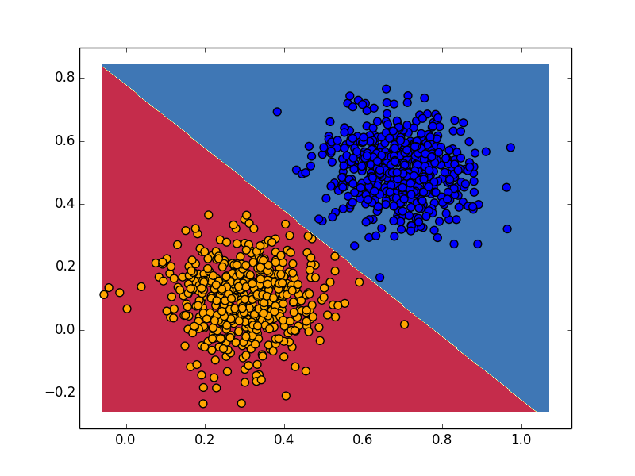
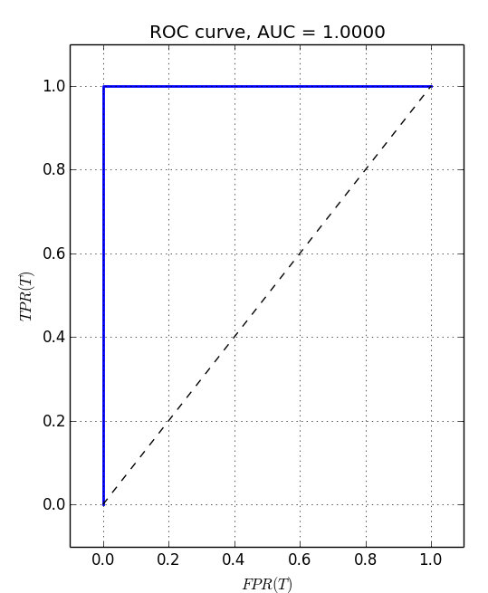

# L2 Loss function


Implementation of the L2 Loss function on linear seperable data. (Test using python 2.7)

Executing the script:
```sh
$ python main.py data/linear_data_train.pickle.gz data/linear_data_test.pickle.gz 100 .01
```
The first argument is training data, second argument is test data, third argument is number of training iterations and fourth is learning rate

Linear seperation using L2 Loss:



ROC Plots:

This is linear seperable dataset, the AUC is expected to be 1 as shown below:


